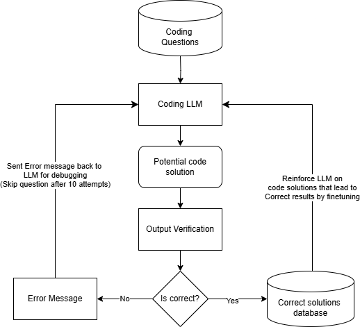

# CodeEvolveLLM 🚀

[](LICENSE)
[](https://python.org)

**Reinforcement Learning for Iterative Code Generation and Optimization**

A framework for fine-tuning local LLMs (Qwen2.5-coder 7B) to generate, debug, and optimize code solutions through automated iterative improvement.

**Repository Link**: `https://github.com/sanskar9999/CodeEvolveLLM` 
**Demo Link**: *Coming soon*

## 🎯 Project Overview

CodeEvolveLLM is an experimental system that combines:
- **Local LLM Code Generation** (Qwen2.5-coder-7B)
- **Automated Code Interpretation** (Python + Docker fallback)
- **RL Fine-tuning** based on solution correctness
- **Iterative Debugging** through automated feedback loops

 

## ✨ Key Features

- **Autonomous Code Generation**: Generate initial solutions for coding problems
- **Self-Debugging Mechanism**: Automatic error detection and solution refinement
- **RL Training Pipeline**: Fine-tune on successful solution trajectories
- **Local Execution**: Runs entirely on consumer hardware (7B parameter model)
- **CLI Interface**: Simple command-line interaction for code generation

## 🛠️ Installation

```bash
# Clone repository
git clone https://github.com/sanskar9999/CodeEvolveLLM
cd CodeEvolveLLM

# Install dependencies
pip install -r requirements.txt

# Download base model (Qwen2.5-coder-7B)
python scripts/download_model.py
```

## 🚀 Usage

### Basic Code Generation
```bash
python main.py --problem "Find the longest substring without repeating characters"
```

### Full Training Pipeline
```bash
# Generate dataset
python generate_dataset.py --problems 1000 --difficulty medium

# Run RL training
python train.py --model qwen-7b --dataset generated_solutions.json
```

## 📂 Dataset Generation

Our automated pipeline creates training data using:
1. 1000+ coding problems (easy to hard difficulty)
2. Gemini Flash API for initial solution attempts
3. Automated correctness verification
4. Iterative debugging traces

```python
# Sample dataset entry
{
  "problem": "Two Sum",
  "initial_solution": "def two_sum(nums, target): ...",
  "debug_traces": [...],
  "final_solution": "optimized implementation",
  "complexity": "O(n)",
  "test_cases": [...]
}
```

## 🧠 Technical Approach

### Reinforcement Learning Strategy
```python
def calculate_reward(solution):
    correctness = 1 if passes_all_tests else 0
    time_complexity = optimal_time_complexity_ratio
    space_complexity = optimal_space_complexity_ratio
    return correctness * (0.7 + 0.2*time_complexity + 0.1*space_complexity)
```

### Training Process
1. Generate initial solution
2. Execute code in sandboxed environment
3. Calculate reward based on:
   - Correctness (primary)
   - Time/Space complexity (secondary)
4. Update model weights using PPO
5. Repeat for 3 iterations max

## 📍 Roadmap

- [x] Phase 1: Basic Code Generation (MVP)
- [ ] Phase 2: Automated Debugging System
- [ ] Phase 3: RL Fine-tuning Pipeline
- [ ] Phase 4: Performance Optimization
- [ ] Phase 5: Web Interface

## 🤝 Contributing

We welcome contributions! Please see our [Contribution Guidelines](CONTRIBUTING.md).

## 📜 License

MIT License - See [LICENSE](LICENSE) for details.

